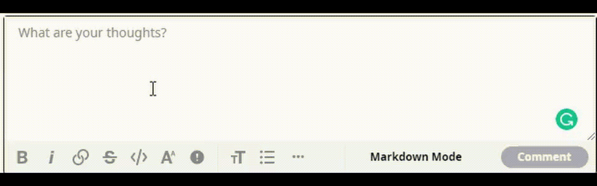

# MathType

This is a program that allows you to easily type Unicode math characters anywhere, including Reddit, Discord, and Twitter. Simply type `Ctrl`+`Win`+`Alt`+`M` and begin entering commands.

# Features

## Greek Letters

Type the name of the Greek letter followed by enter.

For example `tau⏎` → 𝜏 and `Gamma⏎` → 𝛤.

## Exponents and Subscripts

Input | Result | Example
--- | --- | ---
`^⏎` | Enters exponent mode | `e^⏎rt` → 𝑒ʳᵗ
`_⏎` | Enters subscript mode | `x_⏎1` → 𝑥₁
`|⏎` | Enters standard mode | `v_⏎1|⏎ - v_⏎0` → 𝑣₁ − 𝑣₀

## Fonts

Input | Result | Example
--- | --- | ---
`bold` | Enters bold mode | `bold⏎u` → 𝘂
`double` | Enters double struck mode | `double⏎Q` → ℚ
`script` | Enters script mode | `script⏎C` → 𝒞
`mono` | Enters monospace mode | `mono⏎hello` → 𝚑𝚎𝚕𝚕𝚘
`frak` | Enters fraktur mode | `frak⏎x` → 𝔵
`sans` | Enters sans serif mode | `sans⏎T` → 𝖳
`rom` | Enters roman mode | `rom⏎mu⏎m` → μm
`ital` | Enters italics mode (default) | `ital⏎ax` → 𝑎𝑥

## Semantic Output

Each and every outputted character is guaranteed to be semantic. For example:
Input | Output
--- | ---
\- (HYPHEN-MINUS) | − (MINUS SIGN)
\* (ASTERISK) | ⋅ (DOT OPERATOR)
/ (SOLIDUS) | ∕ (DIVISION SLASH)
: (COLON) | ∶ (RATIO)
' (APOSTROPHE) | ′ (PRIME)
SPACE | SIX-PER-EM SPACE
~ (TILDE) | ∼ (TILDE OPERATOR)

## Combining Characters

Input | Output
--- | ---
`phat⏎` | 𝑝̂
`xbar⏎` | 𝑥̅
`xul⏎` | 𝑥̲
`uvec⏎` | 𝑢⃗
`vdot⏎` | 𝑣̇
`vddot⏎` | 𝑣̈
`xcancel⏎` | 𝑥̸
`ctilde⏎` | 𝑐̃

## Automatic Romanizations

Some strings—such as `log`, `ln`, `sin`, `mod`, and `choose`—are automatically change to the roman font.

Insert gif here.

## Character Generation

### Operators

Input | Output
--- | ---
`**⏎` | ∗
`***⏎` | ⋆
`//⏎` | ⁄
`xx⏎` | ×
`-:⏎` | ÷
`+-⏎` | ±
`-+⏎` | ∓
`|><⏎` | ⋉
`><|⏎` | ⋊
`|><|⏎` | ⋈
`o+⏎` | ⊕
`ox⏎` | ⊗
`o.⏎` | ⊙

### Functions

Input | Output
--- | ---
`sqrt⏎` | √
`root(3)⏎` | ∛
`root(4)⏎` | ∜
`sum⏎` | ∑
`prod⏎` | ∏
`int⏎` | ∫
`iint⏎` | ∬
`iiint⏎` | ∭
`iiiint⏎` | ⨌
`oint⏎` | ∮
`oiint⏎` | ∯
`oiiint⏎` | ∰

### Brackets

Input | Output
--- | ---
`|_⏎x_|⏎` | ⌊𝑥⌋
`|~⏎x~|⏎` | ⌈𝑥⌉
`(:⏎x:)⏎` | ⟨𝑥⟩
`||⏎x||⏎` | ‖𝑥‖

### Fractions

Input | Output
--- | ---
`1/4⏎` | ¼
`1/2⏎` | ½
`3/4⏎` | ¾
`1/7⏎` | ⅐
`1/9⏎` | ⅑
`1/10⏎` | ⅒
`1/3⏎` | ⅓
`2/3⏎` | ⅔
`1/5⏎` | ⅕
`2/5⏎` | ⅖
`3/5⏎` | ⅗
`4/5⏎` | ⅘
`1/6⏎` | ⅙
`5/6⏎` | ⅚
`1/8⏎` | ⅛
`3/8⏎` | ⅜
`5/8⏎` | ⅝
`7/8⏎` | ⅞

### Comparison

Input | Output
--- | ---
`:=⏎` | ≔
`!=⏎` | ≠
`?=⏎` | ≟
`Delta=⏎` | ≜
`-=⏎` | ≡
`~=⏎` | ≅
`~~⏎` | ≈
`prop⏎` | ∝
`<=⏎` | ≤
`?<⏎` | ⩻
`!<⏎` | ≮
`!<=⏎` | ≰
`<<⏎` | ≪
`<<<⏎` | ⋘
`>=⏎` | ≥
`?>⏎` | ⩼
`!>⏎` | ≯
`!>=⏎` | ≱
`>>⏎` | ≫
`>>>⏎` | ⋙
`-<⏎` | ≺
`-<=⏎` | ≼
`>-⏎` | ≻
`>-=⏎` | ≽
`in⏎` | ∈
`!in⏎` | ∉
`sub⏎` | ⊂
`sup⏎` | ⊃
`sub=⏎` | ⊆
`sup=⏎` | ⊇

### Arrows

Input | Output
--- | ---
`<=>⏎` | ⇔
`=>⏎` | ⇒
`lArr⏎` | ⇐
`uarr⏎` | ↑
`darr⏎` | ↓
`->⏎` | →
`-->⏎` | ⟶
`>->⏎` | ↣
`->>⏎` | ↠
`>->>⏎` | ⤖
`|->⏎` | ↦
`<-⏎` | ←
`<--⏎` | ⟵
`<->⏎` | ↔

### Miscellaneous

Input | Ouput
--- | ---
`^^⏎` | ∧
`^^^⏎` | ⋀
`vv⏎` | ∨
`vvv⏎` | ⋁
`nn⏎` | ∩
`nnn⏎` | ⋂
`uu⏎` | ∪
`uuu⏎` | ⋃
`not⏎` | ¬
`del⏎` | ∂
`Del⏎` | ∆
`grad⏎` | ∇
`O/⏎` | ∅
`oo⏎` | ∞
`aleph⏎` | ℵ
`/_⏎` | ∠
`frown⏎` | ⌢
`/_\⏎` | △
`diamond⏎` | ⋄
`square⏎` | □
`CC⏎` | ℂ
`NN⏎` | ℕ
`QQ⏎` | ℚ
`RR⏎` | ℝ
`ZZ⏎` | ℤ
`AA⏎` | ∀
`EE⏎` | ∃
`_|_⏎` | ⊥
`TT⏎` | ⊤
`|-⏎` | ⊢
`|=⏎` | ⊨
`''⏎` | ″
`'''⏎` | ‴
`''''⏎` | ⁗
`quad⏎` | EM SPACE
`:.⏎` | ∴
`:'⏎` | ∵
`...⏎` | …
`cdots⏎` | ⋯
`vdots⏎` | ⋮
`ddots⏎` | ⋱

# TODO:
- Give the script a custom tray icon https://autohotkey.com/board/topic/24515-how-to-change-the-tray-icon/?p=158699
  - Fully customize the tray menu
  - Make tray icon change color depending on whether script is activated or not
    - Make make its text match that of the current mode (superscripted, double-struck, etc.)
- Make a program to point out all scary spots, e.g. "are you sure nobody ever wants i∫ instead of ∬"
- In `keyword-sets.js` add `undefined` in spots where no such Unicode character exists
- When script is suspended, change font to italics and elevation to standard.